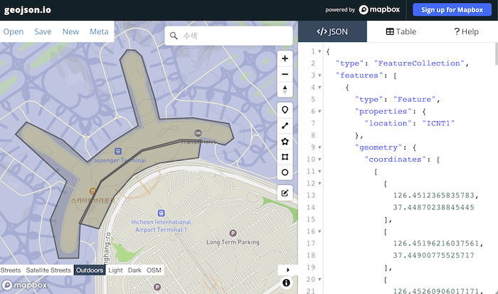
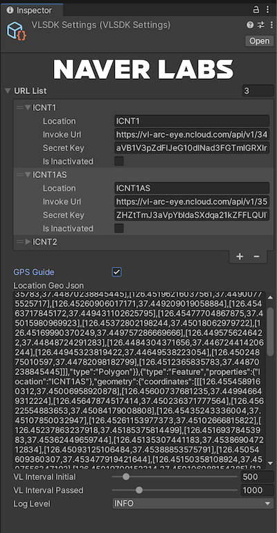
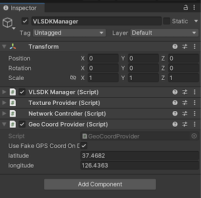
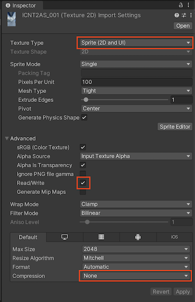

# ARC eye VL SDK

# Overview

ARC eye VL SDK is a Unity package that utilizes ARC eye Visual Localization (VL) API to estimate mobile device location, by measuring the device’s location in a given space. This allows easy implementation of AR applications that utilize spatial information.

# Installation

## ARFoundation Installation

1. In order to use VL SDK, ARFoundation needs to be installed in the Unity project. Open Unity engine, go to Window > Package Manager, and install all packages under the AR section among the Features in Unity Registry.
2. After installing ARFoundation, go to GameObject > XR, and click on AR Session and AR Session Origin to add to Scene.
3. If there is an existing Main Camera, delete it.

<aside>
💡 Caution!
The Tag for AR Camera under AR Session Origin should be set as MainCamera.
</aside>

4. Go to Edit > Project Settings > XR Plug-in Management, and set the following:
    - Under Android settings > Plug-in Provider > check ARCore
    - Under iOS settings > Plug-in Provider > check ARKit
5. (Android) Go to Edit > Project Settings > Player > Android Settings > Other Settings, and modify the following:    
    - Rendering > Graphics APIs > only enable OpenGLES3
    - Identification > Minimum API Level > set level to API Level 24 or higher
    - Configuration > Scripting Backend > set as IL2CPP
    - Configuration > Target Architectures > check ARM64 only

## VL SDK Installation

1. In Unity, go to Assets > Import Packages > Custom Package… and select vl-sdk-unity-1.0.unitypackage to add to Project.
2. In Unity, click GameObject > ARC-eye > VL > Create VLSDKManager to add VLSDKManager to Scene.

## VL API Integration

In order to use VL SDK, a VL API in “Deployment Complete” status with completed VL data conversion is needed. Go to the Project tab and click on Assets > VL > VLSettings.asset to access the settings page.

Enter the InvokeURL and Secret Key from ARC eye > API > API Integration Key Confirmation into the URL List section of VL Settings.

The following table is a detailed description of each item in the URL List:

| Item | Description |
| --- | --- |
| Location | The name of the region where VL API operates. If using GPS Guide, use this value to select which Invoke URL to use. If not using GPS Guide, this value is not used. |
| Invoke Url | The Invoke URL value from ARC eye API Integration Key Confirmation. |
| Secret Key | The Secret Key value from ARC eye API Integration Key Confirmation. |
| Is Inactivated | Check if not using the URL. |

When VL starts, VL request is sent to all addresses in the URL List during the initial localization phase. The request is sent until a successful VL response is received. After a successful VL response, request is sent only using the URL that has previously provided a successful response.

## (Optional) GPS Guide Settings

GPS Guide is a feature that uses smartphone GPS values to select meaningful VL API based on geographical location. This feature requires a string in GeoJSON format with the VL request region settings.

VL SDK uses GeoJSON format specified in RFC 7964. As VL SDK does not provide the feature of generating GeoJSON, use other external tools such as https://geojson.io/ to generate GeoJSON.

In order to generate GeoJSON that can be used in VL SDK, properties in the name of “Location” need to be generated. The value entered in this location field needs to be the same as the Location used when setting up the URL List.

After creating GeoJSON, check the GPS Guide checkbox to activate it, and copy the generated GeoJSON value into the “Location Geo Json” field.

## (Optional) Test GPS Usage

As GPS values cannot be used in the Unity Editor, VL cannot be used properly when GPS Guide is activated. To address this, VLSDKManager provides the Fake GPS feature. Click VLSDKManager and find a component named GeoCoordProvider at the bottom. The GPS value of the device can be used on a smartphone and the GPS value set by the user can be simulated in Unity Editor.

This feature can also be used when testing on a smartphone device. Even without going to the site, when the Fake GPS feature is activated, the GPS value assigned by GeoCoordProvider is used instead of the GPS value of the smartphone device.

# Usage

If VLSDKManager is added and VL API is integrated successfully, AR features based on VL positioning can be used for app building. When the app is launched, VL request starts and the response received through VL request is processed internally, automatically updating the location of AR Session Origin.

## VL Request in Editor

VL SDK allows positioning tests in both Editor and actual devices. On an actual device, VL request is sent using Texture of the camera frame obtained through ARFoundation. In Editor, VL request is sent using TextureProvider component added to VLSDKManager.

Assign Texture to send request to in the “Texture To Send” field. The assigned Texture is used to send VL request. An image file of Texture Type Sprite (2D and UI) or a Render Texture video can be assigned.

If using an image file, click on the file to enter Import Settings and make the setting as following.

If using Video Player, set the Render Mode to Render Texture and assign VideoTexture provided by the VL SDK to the Target Texture.

## Status

VL has three internal states. Initially, it is in the “Initial” state, and the state changes depending on the operation of VL. When the state changes, the OnStateChanged(TrackerState) event of VLSDKManager is called.

| State | Description |
| --- | --- |
| Initial | A state where VL initialization is not completed. The INITIAL state occurs when the app is first launched or when VL request fails a certain number of times. VL request is sent at the interval set in “Request Interval Before Localization” in VL Settings. In this state, AR Session Origin returns to the starting point and all internal sessions of VL are initialized. |
| VL_PASS | A state where VL response is successfully received. VL request is sent at the interval set in “Request Interval After Localization”. |
| VL_FAIL | A state where VL response is temporarily failing. VL request is sent at the interval set in “Request Interval Before Localization”. The AR Session Origin updated through VL request is maintained. If this state persists, it transitions to the INITIAL state.|
| VL_OUT_OF_SERVICE | A state where a valid VL API cannot be found using GPS Guide. Search for valid VL API is continued using GPS values. |

## VLSDKManager

VL control is available in VLSDKManager. VLSDKManager receives camera image and location for each device, sends VL request, and applies the result to Scene. The following methods are available in VLSDKManager:

| Method Name | Description |
| --- | --- |
| StartSession() | Starts PoseTracker session. When the session starts, camera location is updated every frame and VL request is sent when necessary. By default, it is executed in the Start event of VLSDKManager. |
| StopSession() | Stops PoseTracker session. Camera location update stops and VL request is not sent. |
| Reset() | Initializes PoseTracker session. The state turns to INITIAL and AR Session Origin returns to the starting point. |

# License

Please refer to  LICENSE for the complete open-source license information.
