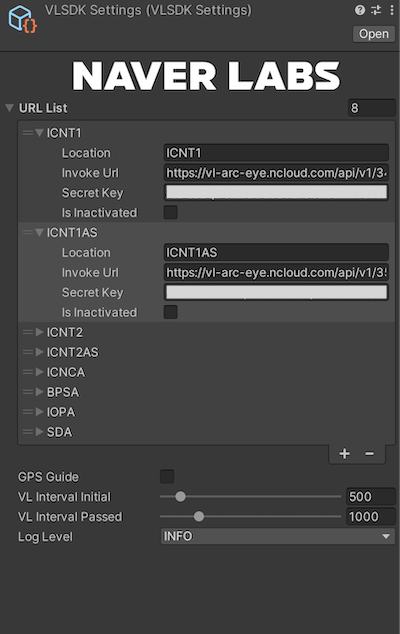
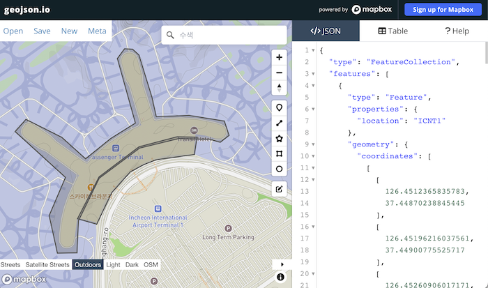
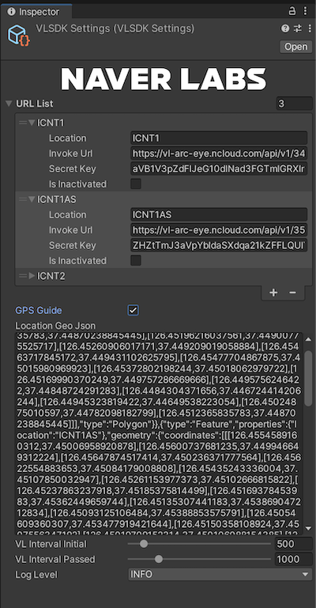
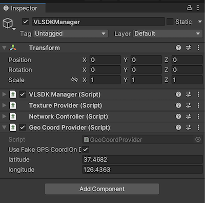
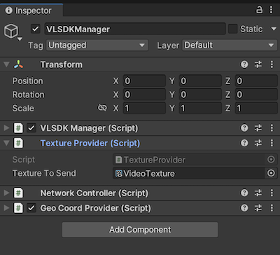
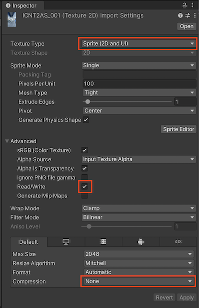
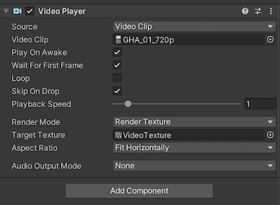

# ARC eye VL SDK

# 개요

ARC eye VL SDK는 ARC eye Visual Localization (VL) API를 이용하여 공간 상에서 모바일 기기의 위치를 측정하여 모바일 기기의 위치를 추정하는 Unity 패키지입니다. 이를 통해 공간 정보를 활용하는 AR 앱을 쉽게 구현할 수 있습니다.

# 설치 방법

## ARFoundation 설치

1. VL SDK를 사용하기 위해서는 Unity 프로젝트에 **ARFoundation**이 설치 되어야 합니다. Unity의 **Window > Package Manager**에서 Unity Registry의 Features 중 AR 항목에 있는 모든 패키지를 설치합니다.
2. ARFoundation의 설치가 완료되면 Unity의 **GameObject > XR**에 있는 **AR Session**과 **AR Session Origin**을 클릭하여 Scene에 추가합니다.
3. 기존에 추가가 되어 있는 Main Camera가 있을 경우 이를 삭제합니다.

<aside>
💡 주의!
AR Session Origin 하위의 AR Camera의 Tag가 MainCamera로 설정이 되어 있어야 합니다.
</aside>

4. Edit > Project Settings > XR Plug-in Management에서 다음 사항들을 설정합니다.
    - Android settings > Plug-in Provider에서 ARCore 체크
    - iOS settings > Plug-in Provider에서 ARKit 체크
5. (Android) Edit > Project Settings > Player > Android Settings > Other Settings에서 다음 사항들을 수정합니다.
    - Rendering > Graphics APIs에서 OpenGLES3만 활성화
    - Identification > Minimum API Level을 API Level 24 이상으로 설정
    - Configuration > Scripting Backend를 IL2CPP로 설정
    - Configuration > Target Architectures 중 ARM64만 체크

## VL SDK 설치

1. Unity 상단 메뉴의 **Assets > Import Packages > Custom Package…** 를 클릭한 후 **vl-sdk-unity-1.0.unitypackage**를 찾아 프로젝트에 추가합니다.
2. Unity 상단 메뉴의 **GameObject > ARC-eye > VL > Create VLSDKManager** 를 클릭하여 VLSDKManager를 Scene에 추가합니다.

## VL API 연동

VL SDK를 사용하기 위해서는 VL 데이터 변환이 완료 된 ‘배포 완료’ 상태의 VL API가 필요합니다. Project 탭에서 Assets > VL > VLSettings.asset을 클릭하여 설정 페이지에 진입합니다.

ARC eye 페이지에서 확인할 수 있는 **ARC eye > API > API 연동 키 확인**의 InvokeURL과 Secret Key를 VL Settings의 URL List 항목에 입력합니다.

URL List의 각 항목들에 대한 세부 설명은 다음과 같습니다.

| 항목 | 설명 |
| --- | --- |
| Location | VL API가 동작하는 지역의 이름입니다. GPS Guide를 사용하는 경우 이 값을 이용하여 어떤 Invoke URL을 사용할지 선택합니다. GPS Guide를 사용하지 않는 경우에는 이 값이 사용되지 않습니다. |
| Invoke Url | ARC eye API 연동 키 확인의 Invoke URL 값입니다. |
| Secret Key | ARC eye API 연동 키 확인의 Secret Key 값입니다. |
| Is Inactivated | 해당 URL을 사용하지 않을 경우 체크합니다. |

VL가 시작되면 최초 위치 추정 단계에서 URL List의 모든 주소들에 대해 VL 요청을 보냅니다. VL 성공 응답을 받을 때까지 요청을 보내게 되며, VL 성공 응답을 받은 이후에는 성공 응답을 받았던 URL만 사용해서 요청을 보내게 됩니다.

## (Optional) GPS Guide 설정

GPS Guide는 스마트폰 기기의 GPS 값을 이용해 지리적으로 의미 있는 VL API들을 선택하는 기능입니다. 이 기능을 사용하기 위해서는 VL 요청 지역이 설정된 geojson 형식의 문자열이 필요합니다.

VL SDK에서는 RFC 7964 명세의 GeoJeon 포맷을 사용합니다. VL SDK는 GeoJson을 생성하는 기능을 제공하지 않기 때문에 [https://geojson.io/](https://geojson.io/) 과 같은 외부의 툴을 사용해 GeoJson을 생성해야 합니다. 

VL SDK에서 사용할 수 있는 GeoJson을 생성하기 위해서는 location이라는 이름의 properties를 생성해야 합니다. 이 location 필드에 들어가는 값은 앞서 URL List를 설정할 때 사용했던 Location과 동일해야 합니다.

GeoJson의 생성이 완료되면 GPS Guide의 체크박스를 눌러 활성화를 한 뒤 Location Geo Json 필드에 앞서 생성한 GeoJson 값을 복사합니다.

## (Optional) 테스트 GPS 사용

Unity Editor에서는 GPS 값을 사용할 수 없기 때문에 GPS Guide가 활성화 된 상태에서는 VL를 정상적으로 사용할 수 없습니다. 이를 위해 VLSDKManager에서는 Fake GPS 기능을 제공하고 있습니다. VLSDKManager를 클릭하면 하단에 GeoCoordProvider라는 컴포넌트가 있는 것을 확인할 수 있습니다. 이를 이용하면 스마트폰 기기에서는 기기의 GPS 값을 사용하고 Unity Editor에서는 사용자가 임의로 설정한 GPS 값으로 시뮬레이션을 할 수 있습니다.

이는 스마트폰 기기에서 테스트를 진행할 경우에도 사용할 수 있습니다. 현장에 가지 않아도 Fake GPS 기능 활성화하면 스마트폰 기기의 GPS 값을 사용하지 않고 GeoCoordProvider에서 할당한 GPS 값을 사용합니다.

# 사용 방법

VLSDKManager가 정상적으로 추가 되고 VL API까지 정상적으로 연동했다면 앱 빌드 시 VL 측위 기반 AR 기능을 사용할 수 있습니다. 앱 실행과 동시에 VL 요청이 시작 되고, VL 요청을 통해 받은 응답은 VL 내부에서 처리하여 AR Session Origin의 위치가 자동으로 갱신 됩니다. 

## Editor 상에서의 VL 요청

VL SDK는 Editor와 실제 디바이스에서 모두 측위 테스트를 할 수 있습니다. 실제 디바이스는 ARFoundation을 통해 획득한 카메라 프레임의 Texture를 이용하여 VL 요청을 보냅니다. Editor에서는 VLSDKManager에 추가된 TextureProvider 컴포넌트를 통해 Texture를 참조하고 VL 요청을 보냅니다.

Texture To Send 필드에 요청을 보내고자 하는 Texture를 할당하면 해당 Texture를 이용해 VL 요청을 보내게 됩니다. 여기에는 Texture Type이 Sprite (2D and UI)인 이미지 파일이나 비디오의 Render Texture를 할당할 수 있습니다.

이미지 파일을 사용할 경우 파일을 클릭하여 Import Settings에 진입한 뒤 아래와 같은 설정을 합니다.

비디오 플레이어를 사용하는 경우 Render Mode를 Render Texture로 설정한 뒤 Target Texture에 VL SDK에 첨부된 VideoTexture를 할당합니다.

## 상태

VL는 내부적으로 세 가지 상태를 가집니다. 최초에는 Initial 상태이며 이후 VL의 동작에 따라 상태가 변경 됩니다. 상태가 변경이 되면 VLSDKManager의 **OnStateChanged(TrackerState)** 이벤트가 호출됩니다.

| 상태 | 설명 |
| --- | --- |
| Initial | VL 초기화가 안 된 상태. 앱 최초 실행 시, 혹은 VL 요청이 일정 수 이상 실패 시 INITIAL 상태가 됩니다. VL Settings의 Request Interval Before Localization에 설정된 주기에 맞춰 VL 요청을 보냅니다. 이 상태가 되면 AR Session Origin은 원점으로 이동하고 VL의 내부 세선은 모두 초기화 됩니다. |
| VL_PASS | VL 응답을 성공적으로 수신한 상태. Request Interval After Localization에서 설정한 주기에 맞게 VL 요청을 보냅니다. |
| VL_FAIL | VL 응답이 일시적으로 실패 중인 상태. Request Interval Before Localization에서 설정한 주기에 맞게 VL 요청을 보냅니다. VL 요청을 통해 갱신된 AR Session Origin은 유지 됩니다. 이 상태가 지속되면 INITIAL 상태로 변환. |
| VL_OUT_OF_SERVICE | GPS Guide 사용 결과 유효한 VL API를 찾을 수 없는 상태. 지속적으로 GPS 값을 이용해 사용 가능한 VL API를 탐색합니다. |

## VLSDKManager

VL의 제어는 VLSDKManager를 통해서 할 수 있습니다. VLSDKManager는 기기 별로 카메라 이미지와 위치를 전달받아 VL 요청을 보내고 그 결과를 Scene에 적용하는 역할을 수행합니다. VLSDKManager에서 사용할 수 있는 메서드는 다음과 같습니다.

| 메서드 이름 | 설명 |
| --- | --- |
| StartSession() | PoseTracker 세션을 시작합니다. 세션이 시작되면 매 프레임마다 카메라의 위치를 갱신하고 필요한 순간에 VL 요청을 보냅니다. 기본적으로 VLSDKManager의 Start 이벤트에서 실행합니다. |
| StopSession() | PoseTracker 세션을 중단합니다. 카메라 위치 갱신이 중단되고 VL 요청을 보내지 않습니다. |
| Reset() | PoseTracker 세션을 초기화합니다. State가 INITIAL이 되고 AR Session Origin이 원점으로 이동됩니다. |

# License

전체 오픈소스 라이선스는 [LICENSE](./LICENSE) 에서 확인하세요.
