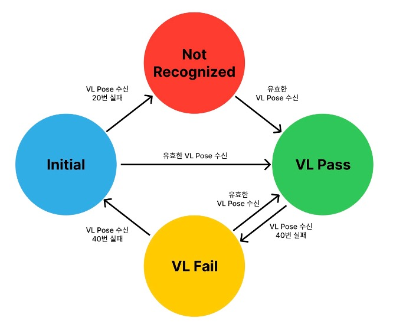

# 사용법

SDK 사용 방법에 대한 설명입니다.

## 초기화
```kotlin
val services = arrayOf(
    VLSDKService("NAVER", "https://vl-arc-eye.ncloud.com/api/v1/123", "bmF2ZXIgbGFicyBzdXBwb3J0cyBhcmNleWUgdmwgc2Rr"),
    VLSDKService("OUTLET", "https://vl-arc-eye.ncloud.com/api/v1/456", "bmF2ZXIgbGFicyBzdXBwb3J0cyBhcmNleWUgdmwgc2Rr"),
    VLSDKService("AIRPORT", "https://vl-arc-eye.ncloud.com/api/v1/789", "bmF2ZXIgbGFicyBzdXBwb3J0cyBhcmNleWUgdmwgc2Rr"),
    ...
)

val config = VLSDKBuilder(services)
    .logLevel(VLSDKLogLevel.WARNING)
    .useDecoder(false)
    .useRaycast(false)
    .requestIntervalBeforeLocalization(300)
    .requestIntervalAfterLocalization(1000)
    .dropResetActive(true)
    .onUpdateFrame { frame ->

    }
    .onUpdateStatus { status ->

    }
    .onUpdateDatasetInfo { datasetInfo ->

    }
    .onResumeRequest {

    }
    .onPauseRequest { reason ->

    }
    .onInvokeAutoReset { reason ->

    }
    .onSetupTextures { textures ->
        
    }
    .build()

val session = VLSDKSession.shared()
session?.setup(activity, config)
```
| 파라미터명      | 설명 |
| ------------ | :---------- |
| `logLevel`       | SDK 로그 레벨 (초기값: `VLSDKLogLevelWarning`) |
| `useDecoder`       | 카메라 대신 디코더 사용 여부 결정 (초기값: `false`) |
| `useRaycast`       | 광선 투사 기능 사용 여부 결정 (초기값: `false`) |
| `requestInterval(beforeLocalization)`       | `VLSDKStatus.VL_PASS` 이 외의 상태 시 VL 요청 간격 밀리초 (초기값: 300) |
| `requestInterval(afterLocalization)`       | `VLSDKStatus.VL_PASS` 상태 시 VL 요청 간격 밀리초 (초기값: 1000) |
| `dropResetActive`  | 디바이스 Pitch에 따른 내부 자동 리셋 기능 사용 여부 결정 (초기값: `true`) |
| `datasetInfoPrior`  | dataset info 필터링 (초기값: `[]`) |
| `onUpdateStatus`      | `VLSDKStatus` 타입의 현재 상태를 제공 (초기값: `null`) |
| `onUpdateDatasetInfo`       | ARC eye 스캔시에 구분한 각 계층의 이름들을 하나로 이어붙인 값 제공 (초기값: `null`) |
| `onUpdateFrame`       | 현재 카메라 프레임 정보 제공, 렌더링에 활용 (초기값: `null`) |
| `onResumeRequest`       | VL 요청 재개 시점을 제공 (초기값: `null`) |
| `onPauseRequest(reason)`       | VL 요청 일시정지 시점을 제공, `VLSDKRequestPauseReason` 타입으로 일시정지 이유 제공 (초기값: `null`) |
| `onInvokeAutoReset(reason)`       | 내부 리셋이 발생하는 시점 제공, `VLSDKAutoResetReason` 타입으로 자동 리셋 이유 제공 (초기값: `null`) |
| `onSetupTextures`       | `EGLContext` 초기화 완료 후 카메라 프리뷰를 GPU 텍스처 형태로 제공, ID 8개를 미리 제공 |

| 함수명      | 설명 |
| ------------ | :---------- |
| `setup(Activity, VLSDKConfig)`      | 초기 설정 적용, 초기화를 해야만 추후 생명주기 및 제어 가능 |

## 프레임 정의

`onUpdateFrame`로부터 제공되는 프레임 정보는 다음과 같습니다:

| 변수명      | 설명 |
| ------------ | :---------- |
| `timestamp`       | 프레임 시간 |
| `viewMatrix`       | 사용자 포즈(회전, 이동) 정보를 담은 GL 좌표계(y-up) 기준 4x4 행렬 (전역 좌표계 -> 카메라 좌표계 전환) |
| `projMatrix`       | 렌더링 시 투영을 위한 4x4 행렬 (뷰포트 갱신 시 해당 값 갱신되며, `near=0.01` `far=100.0` 으로 고정) |
| `textureTransform`       | 렌더링 시 카메라 프리뷰 uv 변환을 위한 3x3 행렬 (뷰포트 갱신 시 해당 값 갱신) |
| `gpuTexture`       | 현재 카메라 프리뷰 GPU 텍스처 ID |
| `bearing`       | 방향 (북쪽 0도, 동쪽 90도, 남쪽 180도, 서쪽 270도) |

## 디코더 정의
ARMetaRecorder 앱을 통해 수집한 데이터셋을 VLSDK에서 수행할 수 있도록 `VLSDKDecoderProxy` 지원:

```kotlin
session.decoder?.let {
    // do something
}?: run {
    // no decoder
}
```

| 함수명      | 설명 |
| ------------ | :---------- |
| `importDataset(uri)`  | 저장된 데이터셋 로드 |
| `seek(float)`       | 디코더 진행 지점 변경 (범위: 0.0 ~ 1.0) |
| `setOnPlaying(callback)`       | 디코더 수행 여부 확인을 위한 콜백 설정 |
| `setOnProgress(callback)`       | 디코더 내부 수행 진행 상황 콜백 설정 (범위: 0.0 ~ 1.0) |

## 포즈 관련 정책
VL SDK에서 최종적으로 제공하는 최종 포즈는 현재 VIO 포즈와 응답 받은 VL 포즈를 적절하게 보정 계산하여 결과물을 산출합니다.

최종 포즈 결과물은 30Hz 로 실시간 제공되며, 렌더링을 고려한다면 이 점을 참고하셔야 합니다.

VL 응답을 이용한 최종 포즈 보정은 사용자가 움직이는 속도에 비례하여 진행합니다.

최종 포즈를 정확하게 계산하기 위해서 VIO 포즈와 VL 포즈의 값이 정확해야 합니다.

정확한 VL 포즈를 받기 위해 SDK 내부에서는 VL을 아무때나 요청하지 않고 특정 자세를 취할 때만 요청합니다.

SDK에서는 디바이스 방향은 기본적으로 `portrait`만 지원합니다. `portrait` 자세로 특정 pitch 및 roll 방향 범위 내에서만 VL을 요청하게 됩니다.


두 이미지는 각각 디바이스를 옆에서 본 방향(좌측)과 앞에서 본 방향(우측)을 나타내며, 각각 pitch와 roll의 각도를 나타냅니다. 좌측 이미지 pitch 임계값은 35도입니다.

양측 이미지 빨강색 영역은 VL 요청을 일시중지하는 구간이며, 관련해서 `onResumeRequest`과 `onPauseRequest(reason)` 콜백을 지원합니다.

`onPauseRequest(reason)`에서 제공해주는 VL 요청 일시정지 이유(`VLSDKRequestPauseReason`)는 다음과 같습니다:

| 상태명      | 설명 |
| ------------ | :---------- |
| `TILTED_DEVICE` | `requestPausePitch` 임계값 기반으로 만들어진 범위 내에 현재 pitch가 들어가지 않은 상태 (좌측 이미지) |
| `SINGULARITY`  | 수학적으로 pitch 값을 하나의 해로 계산할 수 없는 상태, `portrait` 기준 `landscape` 또는 `landscape right`에 해당 (우측 이미지) |

마찬가지로 디바이스를 pitch 방향으로 돌려 내부 리셋을 하는 기능(`dropResetActive`)도 좌측 이미지 내 빨강색 영역을 따릅니다.

## 스레드 관련 정책
기본적으로 SDK 내부에서의 모든 API 처리는 `VLSDKThread`라는 단일 워커 스레드에서 동작합니다.

:::info
따라서 위의 콜백에서 제공하는 데이터들을 다른 스레드(`UIThread` 또는 사용자 정의 스레드)에서 사용할 시 **반드시 동기화에 유의**하셔야 합니다.
:::

## EGL 관련 정책
SDK 내부에서는 카메라 하드웨어로부터 프리뷰를 가장 빠르게 받아올 수 있도록 GPU를 활용합니다.

GPU 활용을 위해 내부에서 `EGLContext`를 `VLSDKThread` 워커 스레드와 함께 관리하며, `setup` 함수 호출 시 모두 초기화 합니다:

1. `EGLDisplay`, `EGLSurface`(PBuffer) 형태로 정의한 뒤에 `EGLContext`와 `VLSDKThread`를 바인딩합니다. (GLES3)
2. GPU 텍스처를 8개를 정의하고, 8개의 텍스처 중 하나의 텍스처에 매 프레임 카메라로부터 프리뷰를 그립니다.
3. 카메라 프리뷰가 그려진 텍스처 ID는 `onUpdateFrame`의 `gpuTexture` 형태로 제공됩니다.

사용자가 제작한 렌더링 엔진에서 SDK 내부 `EGLContext`를 직접 활용할 수 있고, 리소스만 공유하는 별도의 컨텍스트 관리도 가능합니다.

예를 들어, 사용자가 GLES3 렌더링을 SDK 내부 `EGLContext` 직접 활용하고자 한다면, 다음과 같이 초기화하면 됩니다:

1. 기존의 `EGLSurface`가 PBuffer 형태로 정의되어 있던 것을 WindowSurface 형태로 재정의 필요
    * `SurfaceView` 및 `SurfaceHolder.Callback` 정의
    * 만든 `Surface`를 WindowSurface로 활용하기 위해 함수`createNativeLayer`와 `destroyNativeLayer` 활용
2. 내부 `EGLContext`와 `EGLSurface`(WindowSurface) 재정의 된 후, `VLSDKThread` 위에서 `SurfaceView`에 GLES3 렌더링 가능

```kotlin
override fun onSurfaceCreated(holder: SurfaceHolder) {
    session?.createNativeLayer(holder.surface)
}

override fun onSurfaceDestroyed(holder: SurfaceHolder) {
    session?.destroyNativeLayer()
}

val config = VLSDKBuilder()
    .onUpdateFrame { frame ->
        glClearColor(0, 0, 0, 1.0);
        glClear(GL_COLOR_BUFFER_BIT | GL_DEPTH_BUFFER_BIT);

        ...

        GLES30.glDrawArrays(GLES30.GL_TRIANGLES, ...)
    }
    .build()
```
| 함수명      | 설명 |
| ------------ | :---------- |
| `createNativeLayer(Surface)` | 내부적으로 `EGLDisplay`, `EGLSurface`(WindowSurface)로 다시 초기화합니다. |
| `destroyNativeLayer()`       | 내부적으로 `EGLDisplay`, `EGLSurface`를 삭제합니다. |

사용자 입장에서 렌더링 스레드 및 렌더링 컨텍스트를 따로 정의하거나 다른 렌더링 엔진을 쓰고 싶은 경우도 있습니다.

이 때는 SDK 내부 `EGLContext`를 공유 컨텍스트 개념으로 활용하면 됩니다. 해당 예시는 Filament 엔진을 활용한 설정입니다.

1. `onSetupTextures` 시점에서 EGL 초기화가 끝난 상태로, `eglGetCurrentContext`를 통해 현재 `EGLContext` 획득
2. 현재 `EGLContext`를 Filament 엔진의 공유 컨텍스트로 정의하여, 기존에 만든 GPU 리소스를 공유하도록 설정
3. 사용자가 직접 `SurfaceView` 및 `SurfaceHolder.Callback` 정의하고, 만든 `Surface`를 Filament에 바인딩

```kotlin
override fun onSurfaceCreated(holder: SurfaceHolder) {
    swapChain?.let { engine.destroySwapChain(it) }
    swapChain = engine.createSwapChain(surface)
}

override fun onSurfaceDestroyed(holder: SurfaceHolder) {
    swapChain?.let {
        engine.destroySwapChain(it)
        engine.flushAndWait()
        swapChain = null
    }
}

val config = VLSDKBuilder()
    .onSetupTextures { textures ->
        val sharedContext = EGL14.eglGetCurrentContext()
        engine = Engine.create(sharedContext)
    }
    .onUpdateFrame { frame ->
        ...

        if (renderer.beginFrame(swapChain!!, 0)) {
            renderer.render(view)
            renderer.endFrame()
        }
    }
    .build()
```

:::info
렌더링 결과물을 그리는 `Surface`의 너비와 높이가 갱신됨에 따라 뷰포트를 갱신하는 것도 유의해야 합니다.
:::

렌더링에 관련된 자세한 구현은 샘플 예제들에서 참고할 수 있습니다.

## VL 서비스 관련 정책

`VLSDKBuilder` 생성 시점에서 입력받는 `VLSDKService`들의 정의는 다음과 같습니다:

| 변수명      | 설명 |
| ------------ | :---------- |
| `tag`       | VL 서비스 태그 |
| `invokeUrl`       | Arceye URL |
| `secretKey`       | Arceye 비밀 키 |

:::info
현재 VL 서비스 요청은 n개를 등록했다는 가정 하에 다음과 같이 동작합니다:
1. `VLSDKStatus.INITIAL` 및 `VLSDKStatus.NOT_RECOGNIZED` 상태에서는 등록한 모든 VL 서비스들에 일정 간격 밀리 초로 요청
    * VL 서비스 #1 → ... → VL 서비스 #n → VL 서비스 #1 → ... → VL 서비스 #n → ...
2. `VLSDKStatus.VL_PASS` 및 `VLSDKStatus.VL_FAIL` 상태에서는 최초에 통과한 VL 서비스에만 일정 간격 밀리 초로 요청

이로 인해 한 지역에서 다수의 `VLSDKService`를 등록할 시, 1번 단계에서 `VLSDKStatus.VL_PASS` 상태 전환이 늦어질 수 있습니다.

따라서 `VLSDKService`는 되도록이면 하나씩 등록하는 것을 권장합니다.
:::

## 생명 주기 및 제어

| 상태명      | 설명 |
| ------------ | :---------- |
| `INITIAL`     | VL 초기 상태. 포즈가 원점으로 이동하고 VL의 내부 세선은 모두 초기화 |
| `NOT_RECOGNIZED` | VL 초기화가 안 되고 있는 상태. `VLSDKStatus.INITIAL` 상태에서 VL 수신 20번 실패 시 발생 |
| `VL_PASS`      | VL 응답을 성공적으로 수신한 상태 |
| `VL_FAIL`      | VL 응답이 일시적으로 실패 중인 상태. 이 상태가 지속되면 `VLSDKStatus.INITIAL` 초기 상태로 변환 |

VL SDK에서 내부적으로 여러가지 상태를 가짐으로써 생명주기를 관리합니다.

최초에는 `VLSDKStatus.INITIAL` 상태이며 이후 VL의 동작에 따라 상태가 변경 됩니다.

VL 응답이 최초로 들어오면 `VLSDKStatus.VL_PASS`로 전환되고, 만일 VL이 일정 이상 응답하지 않으면 `VLSDKStatus.NOT_RECOGNIZED`로 변경됩니다.

`VLSDKStatus.VL_PASS` 이후 유효하지 않은 VL이 일정 이상 들어오면 `VLSDKStatus.VL_FAIL`이 됩니다.

`VLSDKStatus.VL_PASS` 상태 시 `requestInterval(afterLocalization)` 밀리 초 간격으로 VL 요청을 합니다.

`VLSDKStatus.VL_PASS` 이외의 다른 상태에서는 `requestInterval(beforeLocalization)` 밀리 초 간격으로 VL 요청을 수행합니다.

`VLSDKStatus.VL_FAIL` 이후 유효하지 않은 VL이 일정 이상 들어오면 `VLSDKStatus.INITIAL`로 전환됩니다.



:::info
다만 예외적으로 강제로 `VLSDKStatus.INITIAL` 상태로 자동 전환하는 경우가 있습니다.

실시간 포즈 추정이 잘못되거나 포즈 에러 누적이 심해지면 원활한 앱 경험이 어려워 질 수 있습니다.

따라서 다음 3가지의 경우에 대해서만 내부 리셋을 하여 `VLSDKStatus.INITIAL` 상태로 전환합니다.

`onInvokeReset(reason)`에서 제공해주는 내부 리셋 이유(`VLSDKAutoResetReason`)는 다음과 같습니다:

| 상태명      | 설명 |
| ------------ | :---------- |
| `TILTED_DEVICE`  | 디바이스를 pitch 방향으로 내릴 경우 발생, `dropResetActive`로 활성화 및 비활성화 가능 |
| `VIO_TRACKING_LOSS` | 조명이 어둡거나, 너무 움직임이 지나치게 빠르거나, 특징이 아예 없는 환경에서 발생 |
| `LOCALIZATION_LOSS` | `VLSDKStatus.VL_FAIL` 이후 유효하지 않은 VL이 일정 이상 들어오면 발생  |
| `MONITORING_LOSS` | VL 요청 일시정지 시 최대 허용 이동거리로 거리보다 많이 이동 시 발생  |
:::

생명주기는 정의한 세션을 통해 다음과 같이 제어가 가능합니다:
```kotlin
val session = VLSDKSession.shared(this)
session?.resume()
session?.reset()
session?.pause()
session?.setDropReset(true)
session?.changeViewport(width,height)
session?.setLocalVLSearchRange(radius)
session?.raycast(px,py,{ hit -> hit?.let { } }
session?.destroy()
```

| 함수명      | 설명 |
| ------------ | :---------- |
| `resume()`      | 세션이 시작되면 매 프레임마다 카메라 포즈를 갱신하고 필요한 순간에 VL 요청 시작 |
| `pause()`       | 카메라 포즈 갱신이 중단되고 VL 요청 중단 |
| `destroy()`     | 세션 초기 상태로 변경, Activity 파괴 시 명시적 호출 권장 |
| `reset()`       | 현재 상태가 `VLSDKStatus.INITIAL`이 되고 사용자 포즈가 원점으로 이동 |
| `setDropReset(Bool)`       | 디바이스 Pitch에 따른 내부 자동 리셋 기능 사용 여부 결정 |
| `changeViewport(Int, Int)`       | 목표 뷰포트 해상도 갱신 |
| `setLocalVLSearchRange(Int)` | `VLSDKStatus.VL_PASS` 상태 이후에 VL 요청 탐색 범위를 현재 포즈 중심으로 미터 단위로 설정 |
| `setDatasetInfoPrior(VLSDKDatasetInfo)`  | dataset info 필터링 |
| `raycast(Float, Float, OnRaycastListener)` | 정규화된 화면 좌표를 기준으로 카메라에서 광선 투사를 수행해, 추적된 객체나 표면과의 교차 정보를 반환 |