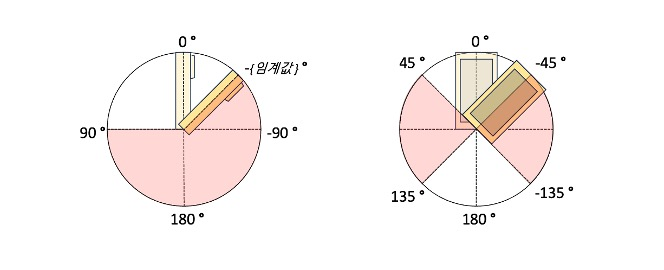

# 사용법

SDK 사용 방법에 대한 설명입니다.

## 초기화
```swift
let nativeBounds = UIScreen.main.nativeBounds
let services = [
    VLSDKService(tag: "NAVER", invokeUrl: "https://vl-arc-eye.ncloud.com/api/v1/123", secretKey: "bmF2ZXIgbGFicyBzdXBwb3J0cyBhcmNleWUgdmwgc2Rr"),
    VLSDKService(tag: "OUTLET", invokeUrl: "https://vl-arc-eye.ncloud.com/api/v1/456", secretKey: "bmF2ZXIgbGFicyBzdXBwb3J0cyBhcmNleWUgdmwgc2Rr"),
    VLSDKService(tag: "AIRPORT", invokeUrl: "https://vl-arc-eye.ncloud.com/api/v1/789", secretKey: "bmF2ZXIgbGFicyBzdXBwb3J0cyBhcmNleWUgdmwgc2Rr"),
]

let config = VLSDKBuilder(services: services)
    .logLevel(.warning)
    .targetFps(.default)
    .viewport(CGSizeMake(nativeBounds.width, nativeBounds.height))
    .useDecoder(false)
    .useRaycast(false)
    .requestInterval(beforeLocalization: 300)
    .requestInterval(afterLocalization: 1000)
    .dropResetActive(true)
    .onUpdateTargetFps({ fps in
                
    })
    .onUpdateFrame({ frame in
        
    })
    .onUpdateStatus({ status in
        
    })
    .onUpdateDatasetInfo({ datasetInfo in
        
    })
    .onResumeRequest {
        
    }
    .onPauseRequest { reason in
        
    }
    .onInvokeAutoReset({ reason in
        
    })
    .build()

session = VLSDKSession.shared()
session?.setup(with: config)
```

| 파라미터명      | 설명 |
| ------------ | :---------- |
| `logLevel`       | SDK 로그 레벨 (초기값: `VLSDKLogLevelWarning`) |
| `targetFps`       | 목표 FPS (초기값: `VLSDKFpsDefault` (30)) |
| `viewport`       | 목표 뷰포트 해상도 초기화, 추후 `setViewport`로 적용 가능 (초기값: `UIScreen.main.nativeBounds` 크기) |
| `useDecoder`       | 카메라 대신 디코더 사용 여부 결정 (초기값: `false`) |
| `useRaycast`       | 광선 투사 기능 사용 여부 결정 (초기값: `false`) |
| `datasetInfoPrior`  | dataset info 필터링 (초기값: `[]`) |
| `requestInterval(beforeLocalization)`       | `VLSDKStatus.VL_PASS` 이 외의 상태 시 VL 요청 간격 밀리초 (초기값: 300) |
| `requestInterval(afterLocalization)`       | `VLSDKStatus.VL_PASS` 상태 시 VL 요청 간격 밀리초 (초기값: 1000) |
| `dropResetActive`  | 디바이스 Pitch에 따른 내부 자동 리셋 기능 사용 여부 결정 (초기값: `true`) |
| `onUpdateTargetFps`      | 현재 목표하는 fps를 재개 시점에 제공 (초기값: `nil`) |
| `onUpdateStatus`      | `VLSDKStatus` 타입의 현재 상태를 제공 (초기값: `nil`) |
| `onUpdateDatasetInfo`       | ARC eye 스캔시에 구분한 각 계층의 이름들을 하나로 이어붙인 값 제공 (초기값: `nil`) |
| `onUpdateFrame`       | 현재 카메라 프레임 정보 제공, 렌더링에 활용 (초기값: `nil`) |
| `onResumeRequest`       | VL 요청 재개 시점을 제공 (초기값: `nil`) |
| `onPauseRequest(reason)`       | VL 요청 일시정지 시점을 제공, `VLSDKRequestPauseReason` 타입으로 일시정지 이유 제공 (초기값: `nil`) |
| `onInvokeAutoReset(reason)`       | 내부 리셋이 발생하는 시점 제공, `VLSDKAutoResetReason` 타입으로 자동 리셋 이유 제공 (초기값: `nil`) |

| 함수명      | 설명 |
| ------------ | :---------- |
| `setup(VLSDKConfig)`      | 초기 설정 적용, 초기화를 해야만 추후 생명주기 및 제어 가능 |

## 프레임 정의

`onUpdateFrame`로부터 제공되는 프레임 정보는 다음과 같습니다:

| 변수명      | 설명 |
| ------------ | :---------- |
| `timestamp`       | 프레임 시간 |
| `viewMatrix`       | 사용자 포즈(회전, 이동) 정보를 담은 GL 좌표계(y-up) 기준 4x4 행렬 (전역 좌표계 -> 카메라 좌표계 전환) |
| `projMatrix`       | 렌더링 시 투영을 위한 4x4 행렬 (뷰포트 갱신 시 해당 값 갱신되며, `near=0.01` `far=100.0` 으로 고정) |
| `textureTransform`       | 렌더링 시 카메라 프리뷰 uv 변환을 위한 3x3 행렬 (뷰포트 갱신 시 해당 값 갱신) |
| `capturedImage`       | 카메라 프리뷰 YUV(`kCVPixelFormatType_420YpCbCr8BiPlanarFullRange`) 버퍼 |
| `bearing`       | 방향 (북쪽 0도, 동쪽 90도, 남쪽 180도, 서쪽 270도) |

## 디코더 정의
ARMetaRecorder 앱을 통해 수집한 데이터셋을 VLSDK에서 수행할 수 있도록 `VLSDKDecoder` 지원:

```swift
session = VLSDKSession.shared()
if let decoder = session.decoder {
    // do something
} else {
    print("No decoder")
}
```

| 함수명      | 설명 |
| ------------ | :---------- |
| `importDataset(url,callback)`  | 저장된 데이터셋 비동기 로드 |
| `getVersion()`       | 디코더 버전 출력 |
| `seek(float)`       | 디코더 진행 지점 변경 (범위: 0.0 ~ 1.0) |
| `playing() -> bool`       | 디코더 수행 여부 확인 |
| `setOnProgress(callback)`       | 디코더 내부 수행 진행 상황 콜백 설정 (범위: 0.0 ~ 1.0) |

## 포즈 관련 정책
VL SDK에서 최종적으로 제공하는 최종 포즈는 현재 VIO 포즈와 응답 받은 VL 포즈를 적절하게 보정 계산하여 결과물을 산출합니다.

최종 포즈 결과물은 사용자가 설정한 목표 FPS(30 또는 60)에 따라 실시간 제공되며,

예외적으로 디코더 사용 시, 사용자가 정의한 목표 FPS와 상관 없이 비디오 FPS에 맞춰 실행됩니다. 

따라서 렌더링에 대한 처리를 고려한다면 `onUpdateTargetFps(Int32)`을 항상 참고하셔야 합니다.

VL 응답을 이용한 최종 포즈 보정은 사용자가 움직이는 속도에 비례하여 진행합니다.

최종 포즈를 정확하게 계산하기 위해서 VIO 포즈와 VL 포즈의 값이 정확해야 합니다.

정확한 VL 포즈를 받기 위해 SDK 내부에서는 VL을 아무때나 요청하지 않고 특정 자세를 취할 때만 요청합니다.

SDK에서는 디바이스 방향은 기본적으로 `portrait`만 지원합니다. `portrait` 자세로 특정 pitch 및 roll 방향 범위 내에서만 VL을 요청하게 됩니다.



두 이미지는 각각 디바이스를 옆에서 본 방향(좌측)과 앞에서 본 방향(우측)을 나타내며, 각각 pitch와 roll의 각도를 나타냅니다. 좌측 이미지 pitch 임계값은 35도입니다.

양측 이미지 빨강색 영역은 VL 요청을 일시중지하는 구간이며, 관련해서 `onResumeRequest`과 `onPauseRequest(reason)` 콜백을 지원합니다.

`onPauseRequest(reason)`에서 제공해주는 VL 요청 일시정지 이유(`VLSDKRequestPauseReason`)는 다음과 같습니다:

| 상태명      | 설명 |
| ------------ | :---------- |
| `TILTED_DEVICE` | `requestPausePitch` 임계값 기반으로 만들어진 범위 내에 현재 pitch가 들어가지 않은 상태 (좌측 이미지) |
| `SINGULARITY`  | 수학적으로 pitch 값을 하나의 해로 계산할 수 없는 상태, `portrait` 기준 `landscape` 또는 `landscape right`에 해당 (우측 이미지) |

마찬가지로 디바이스를 pitch 방향으로 돌려 내부 리셋을 하는 기능(`dropResetActive`)도 좌측 이미지 내 빨강색 영역을 따릅니다.

## VL 서비스 관련 정책

`VLSDKBuilder` 생성 시점에서 입력받는 `VLSDKService`들의 정의는 다음과 같습니다:

| 변수명      | 설명 |
| ------------ | :---------- |
| `tag`       | VL 서비스 태그 |
| `invokeUrl`       | Arceye URL |
| `secretKey`       | Arceye 비밀 키 |

:::info
현재 VL 서비스 요청은 n개를 등록했다는 가정 하에 다음과 같이 동작합니다:
1. `VLSDKStatus.INITIAL` 및 `VLSDKStatus.NOT_RECOGNIZED` 상태에서는 등록한 모든 VL 서비스들에 일정 간격 밀리 초로 요청
    * VL 서비스 #1 → ... → VL 서비스 #n → VL 서비스 #1 → ... → VL 서비스 #n → ...
2. `VLSDKStatus.VL_PASS` 및 `VLSDKStatus.VL_FAIL` 상태에서는 최초에 통과한 VL 서비스에만 일정 간격 밀리 초로 요청

이로 인해 한 지역에서 다수의 `VLSDKService`를 등록할 시, 1번 단계에서 `VLSDKStatus.VL_PASS` 상태 전환이 늦어질 수 있습니다.

따라서 `VLSDKService`는 되도록이면 하나씩 등록하는 것을 권장합니다.
:::

## 생명 주기 및 제어

| 상태명      | 설명 |
| ------------ | :---------- |
| `INITIAL`     | VL 초기 상태. 포즈가 원점으로 이동하고 VL의 내부 세선은 모두 초기화 |
| `NOT_RECOGNIZED` | VL 초기화가 안 되고 있는 상태. `VLSDKStatus.INITIAL` 상태에서 VL 수신 20번 실패 시 발생 |
| `VL_PASS`      | VL 응답을 성공적으로 수신한 상태 |
| `VL_FAIL`      | VL 응답이 일시적으로 실패 중인 상태. 이 상태가 지속되면 `VLSDKStatus.INITIAL` 초기 상태로 변환 |

VL SDK에서 내부적으로 여러가지 상태를 가짐으로써 생명주기를 관리합니다.

최초에는 `VLSDKStatus.INITIAL` 상태이며 이후 VL의 동작에 따라 상태가 변경 됩니다.

VL 응답이 최초로 들어오면 `VLSDKStatus.VL_PASS`로 전환되고, 만일 VL이 일정 이상 응답하지 않으면 `VLSDKStatus.NOT_RECOGNIZED`로 변경됩니다.

`VLSDKStatus.VL_PASS` 이후 유효하지 않은 VL이 일정 이상 들어오면 `VLSDKStatus.VL_FAIL`이 됩니다.

`VLSDKStatus.VL_PASS` 상태 시 `requestInterval(afterLocalization)` 밀리 초 간격으로 VL 요청을 합니다.

`VLSDKStatus.VL_PASS` 이외의 다른 상태에서는 `requestInterval(beforeLocalization)` 밀리 초 간격으로 VL 요청을 수행합니다.

`VLSDKStatus.VL_FAIL` 이후 유효하지 않은 VL이 일정 이상 들어오면 `VLSDKStatus.INITIAL`로 전환됩니다.


:::info
다만 예외적으로 디바이스를 pitch 방향으로 일정 각도 이상 내릴 경우 `VLSDKStatus.INITIAL` 상태로 자동 전환합니다.

`onInvokeAutoReset(reason)`에서 제공해주는 내부 리셋 이유(`VLSDKAutoResetReason`)는 다음과 같습니다:

| 상태명      | 설명 |
| ------------ | :---------- |
| `TILTED_DEVICE`  | 디바이스를 pitch 방향으로 내릴 경우 발생, `dropResetActive`로 활성화 및 비활성화 가능 |
| `LOCALIZATION_LOSS` | `VLSDKStatus.VL_FAIL` 이후 유효하지 않은 VL이 일정 이상 들어오면 발생  |
| `MONITORING_LOSS` | VL 요청 일시정지 시 최대 허용 이동거리로 거리보다 많이 이동 시 발생  |
:::

생명주기는 정의한 세션을 통해 다음과 같이 제어가 가능합니다:

```swift
let session = VLSDKSession.shared()
session?.resume()
session?.reset()
session?.pause()
session?.setDropReset(true)
session?.setViewport(myViewSize)
session?.setLocalVLSearchRange(radius)
let hit = session?.raycast(location);
```

| 함수명      | 설명 |
| ------------ | :---------- |
| `resume()`      | 세션이 시작되면 매 프레임마다 카메라 포즈를 갱신하고 필요한 순간에 VL 요청 시작 |
| `pause()`       | 카메라 포즈 갱신이 중단되고 VL 요청 중단 |
| `reset()`       | 현재 상태가 `VLSDKStatus.INITIAL`이 되고 사용자 포즈가 원점으로 이동 |
| `setDropReset(Bool)`       | 디바이스 Pitch에 따른 내부 자동 리셋 기능 사용 여부 결정 |
| `setViewport(CGSize)`       | 목표 뷰포트 해상도 갱신 |
| `setLocalVLSearchRange(Int32)` | `VLSDKStatus.VL_PASS` 상태 이후에 VL 요청 탐색 범위를 현재 포즈 중심으로 미터 단위로 설정 |
| `setDatasetInfoPrior(VLSDKDatasetInfo)`  | dataset info 필터링 |
| `raycast(CGPoint)` | 정규화된 화면 좌표를 기준으로 카메라에서 광선 투사를 수행해, 추적된 객체나 표면과의 교차 정보를 반환 |
